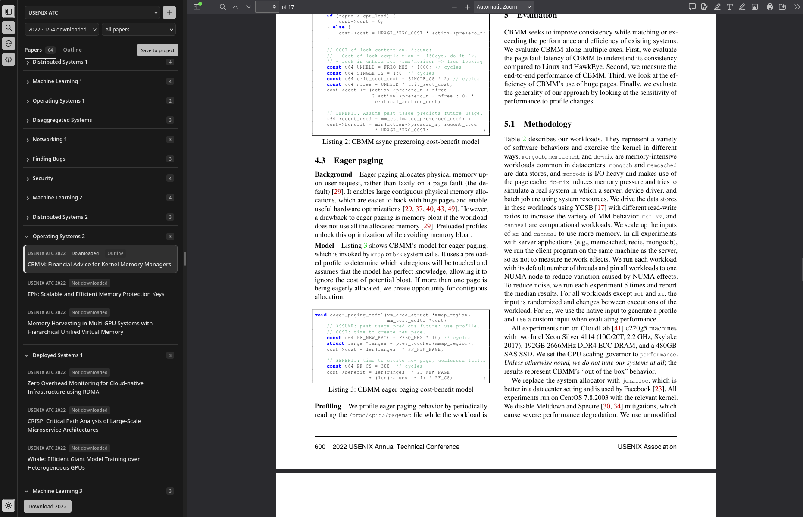
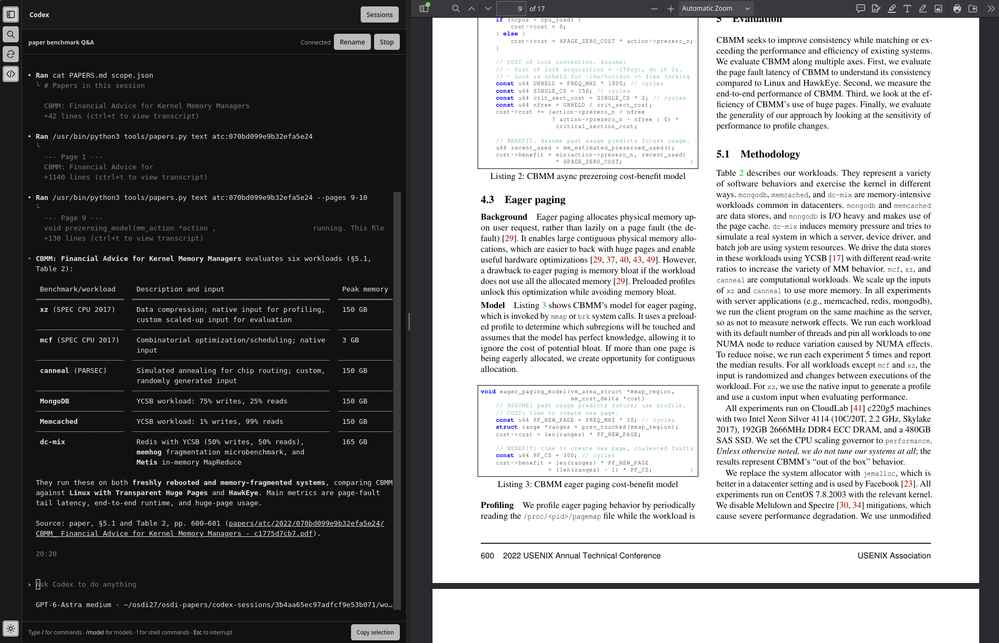

# paper-reading

A local paper-reading app for conference libraries and personal projects, with
paper downloads, outlines, and scoped Codex sessions.

Browse papers by conference, year, and category while reading them alongside the library.



Discuss papers with Codex in a resizable sidebar while keeping the paper open.



The included OSDI downloader retrieves research papers from every edition in the
[USENIX OSDI archive](https://www.usenix.org/conferences/byname/179), starting in
1994. Editions are discovered on each run, so newly published years are picked
up automatically. Future years are excluded unless explicitly requested.

Requires Python 3.10 or newer.

```bash
python3 -m venv .venv
source .venv/bin/activate
python -m pip install -r requirements.txt
python download_osdi.py
```

Files go into `papers/<year>/`, with readable titles and a short identifier to
avoid filename collisions. Each year gets a `manifest.json` containing titles,
source URLs, local paths, file sizes, SHA-256 hashes, and download status.

```text
papers/
  1994/
    Lottery Scheduling ... .pdf
    Scheduling for Reduced CPU Energy ... .ps
    manifest.json
  1999/
    Practical Byzantine Fault Tolerance ... /
      castro.html
      node1.html
      ...
    manifest.json
  2026/
    ... .pdf
    manifest.json
```

The script prefers PDFs. Early editions often offer only PostScript, so those
papers are saved as `.ps` (or compressed PostScript). When only HTML is available,
the script downloads the full paper's section pages and local figures into a
subfolder; open the entry page recorded in the manifest. Plain text is a last
fallback. Slides, videos, keynotes, posters, and proceedings front matter are
excluded.

Useful commands:

```bash
# Preview all paper titles and source pages without writing any files.
python download_osdi.py --dry-run

# See all editions, including announced future conferences.
python download_osdi.py --list-years

# Choose years and a destination.
python download_osdi.py --years 1994 1996 1999 2025 2026 --output ./my-papers

# Test with one paper from each edition.
python download_osdi.py --limit-per-year 1

# Reduce concurrency and space requests further apart.
python download_osdi.py --workers 2 --delay 1
```

Rerun the same command to continue an interrupted download or retry failures.
Completed files are skipped only when their sizes and hashes match the manifest;
missing or changed files are downloaded again. `--force` downloads them again
regardless. Files are written through temporary `.part` files and renamed after
validation. An interrupted transfer restarts that file rather than resuming its
bytes. Ctrl-C cancels queued work; active HTTP requests are allowed to finish or
time out.

The default is four workers, at least 0.3 seconds between requests across all
workers, a 45-second HTTP timeout, and three retries for transient failures.
The script continues after an individual failure and exits with status **1** if
any requested paper or year failed. Failures are recorded in the relevant year's
manifest. An unpublished or inaccessible proceedings page is reported as a
failure, not an empty successful download. `--dry-run` checks the programs only;
it does not verify every full-text link. Limited runs are marked `partial` until
all papers have been downloaded.

Some historical USENIX assets are missing or empty. These are reported as
failures too, including missing figures in an otherwise downloadable HTML paper;
any pages already saved are retained. The script cannot reconstruct content
missing from the publisher's archive.

Run the offline tests:

```bash
python -m unittest discover -s tests -v
```

## Browse papers in a web application

```bash
python3 -m pip install -r requirements.txt
python3 web_app.py
```

Open **http://127.0.0.1:8000**. The app reads the existing `papers/` and
`outlines/` folders. Search or filter papers on the left, then select one to
read it on the right. Switch to **Outline** for the selected paper's section
hierarchy; click a page number or heading to jump to that PDF page.

Use the selector above search to switch between conference libraries and local
projects. Conference libraries include **OSDI, SOSP, NSDI, FAST, USENIX ATC, and
USENIX Security**. OSDI retains its existing archive support. SOSP uses the
[official SIGOPS archive](https://www.sigops.org/s/conferences/sosp/2015/archive/index.html)
and conference programs: odd years from 1967 through 2023, then annually from
2024. The other conference sources support proceedings from 2012 onward (ATC
through 2025). SOSP session categories and published PDF links are preserved.
If an ACM or SIGOPS download fails, the downloader looks for public copies via
Semantic Scholar, OpenAlex, and arXiv. It checks the DOI and title when available,
requires an exact normalized title match for arXiv search, and checks the PDF's
opening pages for the expected title before saving it. A fallback can be an
author's preprint rather than the published version; the progress log identifies
the copy, and the manifest records its source and version. The paper keeps its
original conference identity and filename. Accepted papers can appear before
their PDFs are published, and some papers have no downloadable public copy.
Use **Open source** to visit the official paper page. Failed downloads remain
available for retry.
If the conference lists a paper without a PDF and the public-copy lookup cannot
retrieve one, the reader shows **No PDF found**. **Check again** rereads the
program for new links and retries the lookup. It preserves the paper's identity
and leaves the download queue running.
Selecting a year automatically loads its paper titles, including papers not yet
downloaded. Cached lists appear immediately. Select an individual paper and click
**Download paper**; it opens automatically when the download finishes (older
PostScript papers are converted for the reader as part of that task). Year
selection resets the search and availability filter so missing papers are visible.
If the publisher cannot be reached, the list shows an error and a **Retry** button.
Downloads require one selected year; **All years** is for browsing or finding
paper titles. The year selector shows **✓ Downloaded** when the full cataloged
edition is saved locally, and a count such as **12/20 downloaded** for partial
downloads. Missing files count as missing downloads.
Conference papers are grouped under collapsible session categories from the
official program, in program order. Click a category heading to hide or show its
papers; collapsed groups are remembered across refreshes. Search matches both
paper titles and category names and expands matching groups. **All years** keeps
each year's categories separate. Papers without a published category appear under
**Uncategorized**. Existing catalogs refresh their category metadata when you
select a year, without downloading papers again.
Availability depends on the publisher; unavailable proceedings or downloads
produce an error in the task log and can be retried.

For your own reading collections:

- Click **＋** beside the selector to create a local project.
- **Add paper** accepts a paper URL or a PDF upload, with an optional title.
  URL fetching is available **only in local projects**. Direct PDF URLs, arXiv
  abstract links, and publication pages with PDF metadata/links are supported.
  A page requiring login or without an accessible PDF needs a PDF upload instead.
- Select a downloaded paper in any library and click **Save to project** to copy
  it into a local project. Reimporting the same PDF does not duplicate it.
- Use **⋯** to rename or archive a local project. In its Outline tab,
  **Remove paper** removes a paper from that project.
- The selected project and its last selected paper are remembered independently.

Existing OSDI files stay in `papers/` and `outlines/`. Other conference libraries
use `conferences/<conference>/`; local projects use `projects/<project-id>/`,
with their own `papers/local/` and `outlines/` folders. PDFs placed directly in
a project's paper folder also appear after Refresh. Renaming a project keeps
its folder identifier stable. Archived projects are kept under `projects/.trash/`;
removed papers are kept under the project's `.trash/`. Files in another library
are unaffected. Uploads are limited to 100 MB. Each project's comparison report
covers its own outlines.

Drag the middle divider to resize the panes; the app remembers the width and
last selected paper. The divider also supports arrow keys, Home/End, and a
double-click to reset its width.

The narrow control strip on the far left contains sidebar, search, refresh, and
theme buttons. Hide the sidebar for a wider reader; reopening it restores its
previous width and keeps the current paper open. Search can be hidden separately;
hiding it clears the title query. Its button also opens the sidebar if needed.
Sidebar/search visibility and the theme are remembered across reloads. Dark mode
initially follows the system preference. Papers retain their original colors
in both themes.

- **Download YEAR** downloads missing papers only for the selected year.
- An individual paper has its own **Download paper** button. You can request more
  papers while a task is running; downloads queue in the order you click them.
  Paper badges show **Downloading…** or **Queued** with their queue position.
- **Generate outline** extracts that paper's structure, with progress shown at
  the bottom. Existing outlines have a **Regenerate outline** button.
- Older PostScript papers offer **Open paper in reader** for a cached PDF conversion.

Tasks run in the background, one at a time, while you keep reading. Completed
downloads/outlines persist on disk; refreshing the browser retains task progress.
The queue continues when you switch projects or close the browser, as long as
the server stays running. Each finished download becomes readable immediately;
a failed download does not stop the remaining queue. Repeat clicks do not add
duplicate downloads. Pending tasks are kept in memory until the server stops.
Errors appear in the progress log and failed tasks can be retried. On Linux,
the app detects a command-line downloader running in the same directory and
asks you to wait before starting competing downloads. Title discovery uses a
separate `.catalog/` cache and can run while the command-line downloader is active. Avoid
running command-line download/extraction jobs alongside app jobs.

The app binds to localhost. Use `--port 8080` for another port, or
`--root /path/to/library` for another folder containing `papers/` and `outlines/`.

PDF display uses your browser's built-in viewer. HTML and text papers are also
supported. Keep the server running while tasks complete; logs are saved under
`.web-jobs/`. Generating an outline in the app updates the comparison using all
saved per-paper outlines.

### Codex research sessions

Install the [Codex CLI](https://learn.chatgpt.com/docs/codex/cli) and sign in with
`codex login` on the machine running the reader. The integration uses that local
installation and account. It does not require a separate API key or expose your
credentials to the browser. Linux and macOS are supported; on Windows, run the
reader and Codex inside WSL.
The integration is tested with Codex CLI 0.156.1.

Click the Codex icon in the far-left control strip. Build a scope by adding any
combination of conferences and years, local projects, or individual papers.
**All conferences** plus selected years covers those years wherever the
conference has proceedings. **All years** includes the conference's available
years; add separate selections to use different years for different conferences.
**Current paper** selects the paper open in the reader. Apply the scope to see
its saved sessions, ordered by creation time, newest first.

Create a session with an optional name and starting model, or click a saved
session to continue it. Codex runs in the left sidebar while the paper remains
visible in the reader. Drag the divider to adjust their widths. The sidebar
runs the real interactive Codex CLI:
type `/model` to change models and reasoning, `/permissions` to change command
permissions, `/` to see native commands, and `!` to run a shell command. Keyboard
input, paste, command output, tool progress, approval prompts, and interruption
work in the terminal. Use **Sessions** to return to the scope and session list,
and **Back to session** to return to the terminal. The far-left controls switch
between the paper library and Codex without losing the paper's page or the
running conversation. **Stop** ends the running process; **Resume** reopens its saved
Codex thread. Closing the panel or browser leaves a running session alive while
the reader server remains running.
On first opening a workspace, Codex may show its normal folder trust prompt.
Conversations become resumable after the first message; an empty session opens
a fresh conversation when restarted.

Each session has its own ignored `codex-sessions/<session-id>/` directory:

```text
session.json              # Scope, name, model, timestamps, and native thread id
terminal.log              # Terminal transcript
codex-history.jsonl       # Link to Codex's native saved conversation
workspace/
  AGENTS.md               # Research instructions for this scope
  PAPERS.md               # Human-readable paper index
  scope.json              # Scope and paper metadata
  papers/                 # Links to scoped papers and outlines; fetched full texts
  notes/                  # Space for research output
  tools/papers.py         # Paper discovery, download, and text-extraction helper
```

Downloaded library papers are linked individually so narrow scopes do not link
an entire conference folder. Source links and the index refresh when a stopped
session resumes. Missing full texts remain listed by URL; Codex can use the
helper's `fetch PAPER_KEY` or `fetch --all` commands to retrieve them into its own
workspace. `discover` loads proceedings for selected years not yet catalogued,
and `text PAPER_KEY --pages 1-5` reads a PDF with page markers. These helpers keep
the reader's manifests intact. Session scope supplies research context; it is
not an operating-system security boundary. Sessions start with Codex's
`workspace-write` sandbox and `on-request` approvals.

Conversation history is saved by Codex in its normal local storage, with a link
from the separate session folder. Keep that Codex storage as well as
`codex-sessions/` to resume conversations after restarting the server. Browser
reloads reconnect to the same process. Native `/new`, `/fork`, and `/resume`
commands create or switch Codex threads independently; use the reader's
**New session** button for separately indexed research sessions.

The backend uses the documented [Codex app-server protocol](https://learn.chatgpt.com/docs/app-server)
for model discovery and locating saved threads by their exact workspace, and a PTY for the full
interactive CLI. Browser terminal assets are vendored locally in `web/vendor/`
with their licenses; no CDN is required. Terminal reads and writes require the
reader's same-origin request token. Never expose this local development server
directly to the internet.

## Extract and compare paper outlines from the command line

```bash
python -m pip install -r requirements.txt
python extract_outlines.py
```

Open **`outlines/overview.md`** to compare each paper's main-section sequence and
follow links to its complete outline. Each paper gets Markdown and JSON files in
`outlines/<year>/`, containing section/subsection titles, levels, and page
locations. `outlines/sections.csv` provides a spreadsheet-friendly version;
`outlines/index.json` contains all results, including extraction failures and
review notes. Output filenames do not repeat the year.

For example, the extracted main structure of *Lottery Scheduling* is:

```text
1 Introduction
2 Lottery Scheduling
3 Modular Resource Management
4 Implementation
5 Experiments
6 Managing Diverse Resources
7 Related Work
8 Conclusions
```

Useful options:

```bash
# Focus the comparison on particular editions.
python extract_outlines.py --years 2023 2024 2025

# Extract main sections only.
python extract_outlines.py --max-depth 1

# Process a separate collection or an individual PDF.
python extract_outlines.py --input ./my-papers --output ./my-outlines

# Fast, offline pass with OCR disabled; unreadable papers get review notes.
python extract_outlines.py --ocr never
```

The extractor prefers embedded PDF bookmarks. For papers without them it uses
section numbering, font sizes, and bold text, accounting for two columns,
separate section-number fragments, and wrapped headings. HTML bundles use their
heading tags; ASCII files use a less reliable text-only fallback. The downloader's
manifest identifies complete HTML bundles so individual section pages are not
mistaken for separate papers. You can rerun extraction as more downloads finish.

PostScript requires **Ghostscript** (`gs` on your PATH). Conversion happens in
`outlines/.cache/`; source papers are never modified.
Printer files with descending numbered pages are reordered in the converted PDF.
When text is unreadable or too few headings are found, the default `--ocr auto`
uses PyMuPDF's local OCR at 300 DPI.
If English language data is unavailable, it downloads a pinned, SHA-256-checked
4 MB model from the official
[Tesseract tessdata_fast repository](https://github.com/tesseract-ocr/tessdata_fast).
No paper content is uploaded. Use `--tessdata /path/to/tessdata` to supply your
own English model, or `--ocr never` to prohibit OCR and its model download.

Outlines, converted PDFs, and OCR page text are cached. `--force` regenerates
outlines while reusing conversion/OCR caches. Changing the OCR resolution with
`--dpi` creates a separate OCR cache. OCR may take several seconds per page.

These are **extracted outlines, not guaranteed author-written tables of
contents**. `ok` means no automated checks raised a warning; it does not mean a
human verified the result. OCR, plain-text input, missing section numbers, and
very short outlines, and headings ending in an unresolved hyphen are marked
`needs_review`. Check the source before copying a
structure. Review notes do not make the command fail; actual extraction failures
produce exit status 1, and processing continues for the other papers.

Page numbers include publisher cover sheets. Page ranges end at the start page
of the next section at the same or a higher level, so adjacent ranges can overlap;
they are useful for navigation, not exact section lengths. HTML and ASCII papers
have no inferred page counts. The comparison and recurring-title counts cover
the papers selected in the current run, including results marked for review.

The PDF extraction uses the documented
[PyMuPDF text and font APIs](https://pymupdf.readthedocs.io/en/latest/recipes-text.html).
